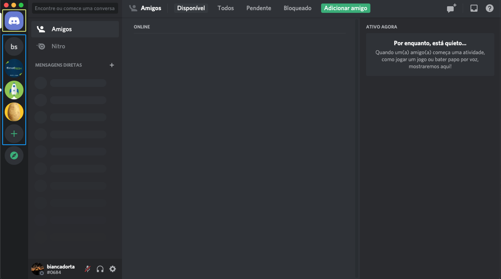

# Discord
    Para podermos nos comunicar no dia da dinâmica em grupo, vamos utilizar o **Discord**, para quem não conhece é um aplicativo gratuito, onde podemos ter comunicação por texto, imagem, vídeo e áudio entre os usuários em um canal de bate-papo.

## Ainda não tem conta no Discord? Segue aqui os passos pra você
### 1. Como acessar: 
    Acesse esse link: https://discord.com/   

### 2. Para criar uma conta: 

### 3. Estrutura básica do Discord
  
    1. Início[em amarelo]: podemos falar individualmente com os amigos que tivermos no Discord, por mensagens, vídeo ou aúdio.    
    2. Servidores[em azul]: São os servidores, são como um grupo, onde nele você pode ter chamadas de voz, de vídeo, e um canal para bate-papo em grupo.

## Ja tem uma conta? Se liga em como será no dia:
    Será compartilhado com vocês um link para entrar no Servidor do Estágio Tech 2021. Dentro do Discord vocês serão divididos em grupos, conforme orientações dos responsáveis, onde terão uma sala para cada grupo.
