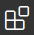

# preparativos-dojo
Intruções para se preparar para a dinâmica de estágio 2021

## Tópicos
* [Primeiros passos](#Primeiros-passos)
    * [Instalando no computador](#Instalando-no-computador)
        * [Live Share](#Live-Share)
    * [Usando no navegador (browser)](#Usando-no-navegador-(browser))
* [Instruções durante o Dojo](#Instruções-durante-o-Dojo)
    * [Chamar atenção](#Chamar-atenção)
    * [Seguir cursor](#Seguir-cursor)
    * [Execução do programa](#Execução-do-programa)
    * [Comentários na linha](#Comentários-na-linha)
    * ["Fui kickado sem querer! E agora!?"](#"Fui-kickado-sem-querer!-E-agora!?")
    * [Bugs conhecidos (e como evitá-los!)](#Bugs-conhecidos-(e-como-evitá-los!))
* [Dicas](#Dicas)

## Primeiros passos
### Instalando no computador
Você pode instalar o VS Code pelos links de Download em: https://code.visualstudio.com/Download

#### Opções para se instalar em Linux:  
Você pode consultar instruções (em inglês!) nos [documentos do site oficial](https://code.visualstudio.com/docs/setup/linux), mas aqui vai uma lista para os casos mais comuns:
##### Distribuições Ubuntu ou baseadas em Debian:
##### Distribuições Fedora:

#### Live Share
Para realizar o Dojo, você precisará instalar a extensão ___Live Share___. Basta procurar e instalar pela aba de extensões   

### Usando no navegador (browser)
  
Detalhe, não se esqueça que você está no navegador! Comandos como <kbd>Ctrl+Q</kbd> ou <kbd>Ctrl+W</kbd> podem fechar a janela/aba... E aí será preciso reconectar na sala!
## Instruções durante o Dojo
Para melhorar a experiência durante a dinâmica e abrir espaço para todos, serão propostas certas regras:
### Chamar atenção
O botão **"Chamar Atenção" (Focus Attention)** quando quiser que todos os participantes olhem para a sua linha atual. Use-o apenas quando você for o **piloto** da rodada, ou quando 
### Seguir cursor
### Execução do programa
### Comentários na linha
### "Fui kickado sem querer! E agora!?"
### Bugs conhecidos (e como evitá-los!)
## Dicas
