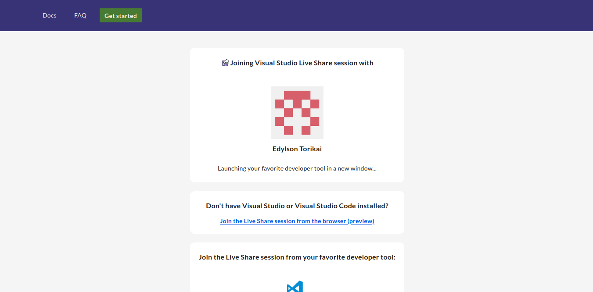

# VS Code

## Tópicos
- [VS Code](#vs-code)
  - [Tópicos](#tópicos)
  - [Primeiros passos](#primeiros-passos)
    - [Instalando no computador](#instalando-no-computador)
      - [Opções para se instalar em Linux:](#opções-para-se-instalar-em-linux)
        - [Distribuições Ubuntu ou baseadas em Debian:](#distribuições-ubuntu-ou-baseadas-em-debian)
        - [Distribuições Fedora:](#distribuições-fedora)
  - [Extensões](#extensões)
      - [Java Extension Pack](#java-extension-pack)
      - [Live Share](#live-share)
      - [Usando o Live Share no navegador (browser)](#usando-o-live-share-no-navegador-browser)
  - [Instruções duranhttps://prod.liveshare.vsengsaas.visualstudio.com/join?3EF1A6FB75930038AD4F22149CE0C1AA48B3te o Dojo](#instruções-durante-o-dojo)
    - [Chamar atenção](#chamar-atenção)
    - [Seguir cursor](#seguir-cursor)
    - [Execução do programa](#execução-do-programa)
    - [Comentários na linha](#comentários-na-linha)
    - ["Fui kickado sem querer! E agora!?"](#fui-kickado-sem-querer-e-agora)
    - [Bugs conhecidos (e como evitá-los!)](#bugs-conhecidos-e-como-evitá-los)
  - [Dicas](#dicas)

## Primeiros passos
### Instalando no computador
Você pode instalar o VS Code pelos links de Download em: https://code.visualstudio.com/Download  
Você pode também instalar o VS Code já configurado para desenvolvimento Java (com as extensões e o JDK), para `windows` e `mac` nesse link: https://code.visualstudio.com/docs/java/java-tutorial

#### Opções para se instalar em Linux:  
Você pode consultar instruções (em inglês!) nos [documentos do site oficial](https://code.visualstudio.com/docs/setup/linux), mas aqui vai uma lista para os casos mais comuns:
##### Distribuições Ubuntu ou baseadas em Debian:
##### Distribuições Fedora:

## Extensões

#### Java Extension Pack
Iremos utilizar a linguagem Java no Dojo então é interessante que vocês instalem o ___Java Extension Pack___. Basta procurar e instalar pela aba de extensões  
  

#### Live Share
Para realizar o Dojo, você precisará instalar a extensão ___Live Share___. Basta procurar e instalar pela aba de extensões  
  

#### Usando o Live Share no navegador (browser)
  
Detalhe, não se esqueça que você está no navegador! Comandos como <kbd>Ctrl+Q</kbd> ou <kbd>Ctrl+W</kbd> podem fechar a janela/aba... E aí será preciso reconectar na sala!

## Instruções durante o Dojo
Para melhorar a experiência durante a dinâmica e abrir espaço para todos, serão propostas certas regras:
### Chamar atenção
O botão **"Chamar Atenção" (Focus Attention)** quando quiser que todos os participantes olhem para a sua linha atual. Use-o apenas quando você for o **piloto** da rodada, ou quando julgar necessário ;)

Ao utilizar esta função, todos os participantes entram no modo "Seguindo cursor".

### Seguindo cursor
Quando estiver nesse modo, o seu cursor vai ficar seguindo o cursor de algum outro participante. Para desabilitá-lo, basta clicar no círculo colorido à esquerda do nome do participante que está seguindo (no menu lateral da aba Live Share).

### Execução do programa/Terminal compartilhado
É possível compartilhar a visão de um terminal dentro do VS Code. O programa será executado através deste terminal, caso seja necessário executá-lo.

Atenção! Por questões de segurança, não será liberado a permissão de escrita no terminal para os participantes da dinâmica! Apenas os condutores da dinâmica terão essa habilidade.

### Comentários na linha
**Lembre-se de respeitar o piloto e o co-piloto!**  
É possível deixar comentários em uma linha clicando no botão <kbd>+</kbd> logo ao lado do número da linha. Entretanto, use-o com bom senso!

### "Fui kickado sem querer! E agora!?"
Nada de pânico! A única pessoa que pode expulsar outros usuários da sala é o dono da sessão Live Share (host), e ele não expulsará ninguém intencionalmente :)  
Mas caso isso venha a acontecer, basta notificar ao grupo da dinâmica sobre o ocorrido. Assim, uma nova sessão Live Share deverá ser criada, e a dinâmica prosseguirá normalmente.

### Bugs conhecidos (e como evitá-los!)
Até o momento, foi identificado apenas um bug... e ele pode acontecer ao usar a **versão do navegador**.  
<small>_"- Heey...! Com a versão instalada não teremos esse problema... hehe"_ :stuck_out_tongue:</small>

Às vezes, ao salvar um arquivo e imediatamente tirar o foco do VS Code (trocar de janela, por exemplo), o arquivo fica salvando em loop, e crescendo sem parar!  

Felizmente a solução é simples: caso o bug aconteça com você, basta fechar o arquivo do seu editor!

## Dicas
