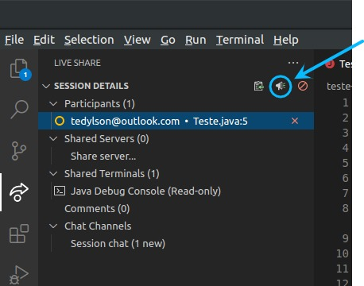

# VS Code

## Tópicos
- [Primeiros passos](#primeiros-passos)
    - [Usando o Live Share](#usando-o-live-share)
      - [No desktop](#no-desktop)
      - [No broswer](#no-browser)
- [Instruções durante o Dojo](#instruções-durante-o-dojo)
  - [Chamar atenção](#chamar-atenção)
  - [Seguindo cursor](#seguindo-cursor)
  - [Undo e Redo](#undo-e-redo)
  - [Terminal compartilhado](#terminal-compartilhado)
  - [Comentários na linha](#comentários-na-linha)
  - ["Fui kickado sem querer! E agora!?"](#fui-kickado-sem-querer-e-agora)
  - [Bugs conhecidos (e como evitá-los!)](#bugs-conhecidos-e-como-evitá-los)
- [Atalhos do teclado](#atalhos-do-teclado)

## Primeiros passos

### Usando o Live Share
#### No desktop
Como funcionará no dia! Você receberá um link com uma carinha parecida com essa:  
Exemplo `https://prod.liveshare.vsengsaas.visualstudio.com/join?CE765A3F501EAA2589271114DE6DFC8FABDC`

  

Automaticamente surgirá uma opção para fazer a conexão com a sessão usando o próprio VS Code!

#### No browser
Detalhe, não se esqueça que você está no navegador! Comandos como <kbd>Ctrl+Q</kbd> ou <kbd>Ctrl+W</kbd> podem fechar a janela/aba... E aí será preciso reconectar na sala!

## Instruções durante o Dojo
Para melhorar a experiência durante a dinâmica e abrir espaço para todos, serão propostas certas regras:

### Chamar atenção
Use o botão **"Chamar Atenção" (Focus Participants)** quando quiser que todos os participantes olhem para a sua linha atual. Use-o apenas quando você for o **piloto** da rodada, ou quando julgar necessário!

Ao utilizar esta função, todos os participantes entram no modo "Seguindo cursor".

### Seguindo cursor
Quando estiver nesse modo, o seu cursor vai ficar seguindo o cursor de algum outro participante. Para desabilitá-lo, basta clicar no círculo colorido à esquerda do nome do participante que está seguindo (no menu lateral da aba Live Share).

### Undo e Redo
Ahh, famoso <kbd>Ctrl+Z</kbd> e <kbd>Ctrl+Y</kbd> que já salvou tanto...

Então, infelizmente o Undo e Redo dentro do Live Share é **compartilhado**! Ou seja, _"Cuidado para não desfazer as coisas do colega sem querer!"_

### Terminal compartilhado
É possível compartilhar a visão de um terminal dentro do VS Code. O programa será executado através deste terminal, caso seja necessário executá-lo.

Atenção! Por questões de segurança, não será liberado a permissão de escrita no terminal para os participantes da dinâmica! Apenas os condutores da dinâmica terão essa habilidade.

### Comentários na linha
**Lembre-se de respeitar o piloto e o co-piloto!**  
É possível deixar comentários em uma linha clicando no botão <kbd>+</kbd> logo ao lado do número da linha. Entretanto, use-o com bom senso!

### "Fui kickado sem querer! E agora!?"
Nada de pânico! A única pessoa que pode expulsar outros usuários da sala é o dono da sessão Live Share (host), e ele não expulsará ninguém intencionalmente :)  
Mas caso isso venha a acontecer, basta notificar ao grupo da dinâmica sobre o ocorrido. Assim, uma nova sessão Live Share deverá ser criada, e a dinâmica prosseguirá normalmente.

### Bugs conhecidos (e como evitá-los!)
Até o momento, foi identificado apenas um bug... e ele pode acontecer ao usar a **versão do navegador**.  
_"- Heey...! Com a versão instalada não teremos esse problema... hehe"_ :stuck_out_tongue:

Às vezes, ao salvar um arquivo e imediatamente tirar o foco do VS Code (trocar de janela, por exemplo), o arquivo fica salvando em loop, e crescendo sem parar!  

Felizmente a solução é simples: caso o bug aconteça com você, basta fechar o arquivo do seu editor!

## Atalhos do teclado
Bom, a gente sabe que atalhos no teclado são uma maravilha, e economizam muito tempo!  
Tá aí então uma colinha de atalhos padrão do VS Code :wink:

[Windows](https://code.visualstudio.com/shortcuts/keyboard-shortcuts-windows.pdf)  
[Linux](https://code.visualstudio.com/shortcuts/keyboard-shortcuts-linux.pdf)  
[MacOS](https://code.visualstudio.com/shortcuts/keyboard-shortcuts-macos.pdf)

Você pode também consultar alguns atalhos dentro do próprio VS Code  

Caso já esteja acostumado com algum outro editor (Vim, Emacs, Eclipse, Sublime, Atom, ...) poderá utilizar alguns atalhos através de extensões Keymaps. Basta acessar o menu e procurar por **File > Preferences > Keymap Extensions**  

