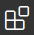
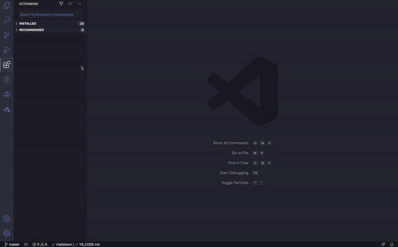
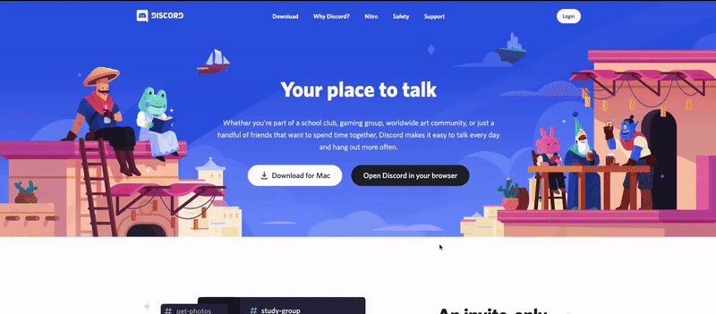
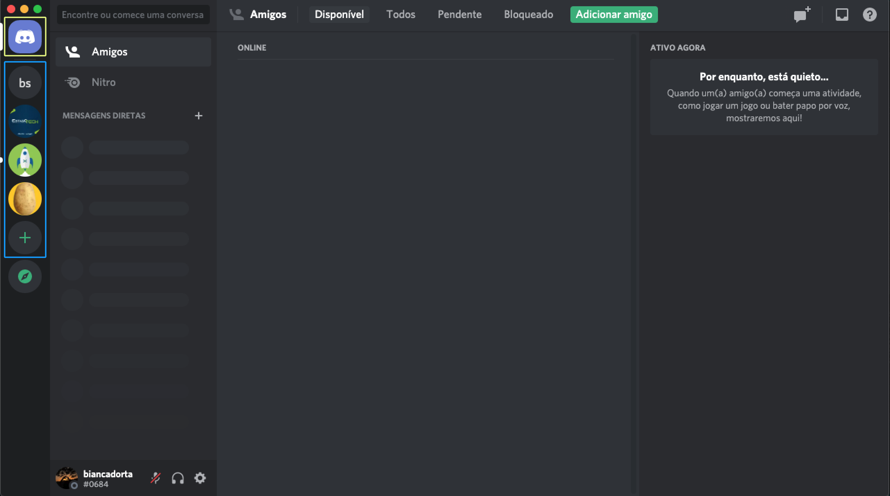

# Instalando programas

Durante o dojo, o VS Code (com Live Share) e Discord serão as ferramentas principais que vamos usar! o/

Nessa página aqui terá instruções para instalá-los nos SOs Windows, MacOS e Linux (Ubuntu principalmente)

:warning: A propósito, a linguagem que será utilizada durante o dojo é Java! Mas não se preocupe, não é preciso tê-lo instalado na hora! Aqui vão estar instruções para caso queira brincar com a linguagem para se preparar :wink:

## Manuais
- [VS Code](#vs-code)
- [Discord](#discord)
- [Java](#java-opcional)

## VS Code

### Windows e MacOS
Preferivelmente, você pode instalar o VS Code já com algumas extensões que vão auxiliar no manuseio do Java:

[Windows](https://aka.ms/vscode-java-installer-win)  
[MacOS](https://aka.ms/vscode-java-installer-mac)

Doc. oficial [aqui](https://code.visualstudio.com/docs/java/java-tutorial)

É recomendável instalar o JDK (Java Development Kit) e as extensões. Se optar por essa alternativa, já terá o java instalado junto!

Ou ainda, você pode também instalar apenas o VS Code utilizando os instaladores, que podem ser encontrados em: https://code.visualstudio.com/Download

### Opções para se instalar em Linux:  
Você pode consultar instruções (em inglês!) nos [documentos do site oficial](https://code.visualstudio.com/docs/setup/linux), mas aqui vai uma lista para os casos mais comuns (instruções apenas para Sistemas Operacionais 64-bit):

#### Distribuições Ubuntu ou baseadas em Debian:
Baixe o [arquivo .deb](https://go.microsoft.com/fwlink/?LinkID=760868), e em seguida rode os comandos:
```bash
sudo dpkg -i <file>.deb
sudo apt-get install -f # Instala dependências
```

#### Distribuições Fedora:
Rodar os comandos abaixo para registrar o repositório do VS Code.
```
sudo rpm --import https://packages.microsoft.com/keys/microsoft.asc
sudo sh -c 'echo -e "[code]\nname=Visual Studio Code\nbaseurl=https://packages.microsoft.com/yumrepos/vscode\nenabled=1\ngpgcheck=1\ngpgkey=https://packages.microsoft.com/keys/microsoft.asc" > /etc/yum.repos.d/vscode.repo'
```

Atualizar e instalar o pacote do editor:

Usando `dnf` (Versão Fedora 22 ou acima)
```
sudo dnf check-update
sudo dnf install code
```

Usando `yum` para versões anteriores do Fedora:
```
yum check-update
sudo yum install code
```

---

### Extensões
O suporte para linguagem Java, e o Live Share são instalados através das extensões do VS Code! Para acessar a aba de extensões, acesse o ícone que fica na barra lateral da esquerda do editor  
 :point_left:

#### Live Share
Esse aqui é essencial! Para realizar o Dojo, você precisará instalar a extensão ___Live Share___.

 Para utilizar o Live Share, **é preciso** ter uma conta **GitHub** ou **Microsoft**!


#### Java Extension Pack (Opcional)
Essa extensão é opcional, mas ela traz funcionalidades interessantes como: autocomplete, erros de sintaxe, etc.


Caso ainda não tenha o JDK instalado, na sessão [Java](#java) há instruções para configurá-lo em Linux.  
Obs.: Estou assumindo aqui que se você usa Windows ou Mac, o JDK foi instalado via o instalador do VS Code mencionado [acima](#windows-e-macos)! :stuck_out_tongue:

## Discord
Para podermos nos comunicar no dia da dinâmica em grupo, vamos utilizar o Discord, para quem não conhece é um aplicativo gratuito, onde podemos ter comunicação por texto, imagem, vídeo e áudio entre os usuários em um canal de bate-papo.

### Ainda não tem conta no Discord? Segue aqui os passos para criar uma!
#### 1. Como acessar: 
Acesse esse link: https://discord.com/

#### 2. Para criar uma conta: 


#### 3. Estrutura básica do Discord

1. Início[em amarelo]: podemos falar individualmente com os amigos que tivermos no Discord, por mensagens, vídeo ou aúdio.  </br> 
2. Servidores[em azul]: São os servidores, são como um grupo, onde nele você pode ter chamadas de voz, de vídeo, e um canal para bate-papo em grupo.


### Ja tem uma conta? Se liga em como será no dia:
Será compartilhado com vocês um link para entrar no Servidor do Estágio Tech 2021. Dentro do Discord vocês serão divididos em grupos, conforme orientações dos responsáveis, onde terão uma sala para cada grupo.

## Java (Opcional)
Utilizaremos a linguagem Java no Dojo, porém não será necessário ter um ambiente java de desenvolvimento configurado, já que as pessoas que vão acompanhar vocês no Dojo que ficarão responsáveis por rodar o código.

Mesmo assim é bacana ter o __Java Extension pack__ instalado no VS Code para facilitar no desenvolvimento.  

### Getting started
Se você nunca desenvolveu em Java, é interessante dar uma estudada básica na sintaxe para não ficar perdido no dia! Seguem aqui algumas opções para espiar o básico da sintaxe:
- [W3Schools](https://www.w3schools.com/java/java_syntax.asp)
- [Tutorials Point](https://www.tutorialspoint.com/java/java_basic_syntax.htm)

Se bater aquela preguiça pra configurar tudo antes de poder brincar com a linguagem... ainda existe a opção de testá-la online! Segue aí algumas sugestões:
- [Repl.it](https://repl.it/languages/java10)
- [OnlineGDB](https://www.onlinegdb.com/online_java_compiler)
- [Tutorials Point](https://www.tutorialspoint.com/compile_java_online.php)
- [IDE One](https://ideone.com/)

### Instalando o JDK (opcional)
Para usuários de Windows ou Mac: no caso do Dojo... a maneira mais fácil é usando o instalador do VS Code que já vem com Java! Caso já tenha instalado o VS Code sem usar esse instalador, não tem problema! O instalador também serve para instalar somente o JDK. :wink:

Nos demais casos (Linux em geral), a coisa é manual. 
### Instalação convencional do JDK
Baixe o arquivo compactado do JDK da [AdoptOpenJDK](https://github.com/AdoptOpenJDK/openjdk11-binaries/releases/download/jdk-11.0.8+10/OpenJDK11U-jdk_x64_linux_hotspot_11.0.8_10.tar.gz).  
Fica aqui apenas para registro, caso venha a curiosidade: a versão desse arquivo é o OpenJDK 11, com a implementação HotSpot da JVM

Após baixar o arquivo, abra o terminal e vá até o local onde baixou o arquivo (provavelmente em Downloads) e extraia o conteúdo usando o comando
```bash
tar xf OpenJDK11U-jdk_x64_linux_hotspot_11.0.8_10.tar.gz
```
Após isso, você deverá ter a pasta `jdk-11.0.8+10` no diretório.

Crie uma pasta `.java_versions` na sua Home para deixar essa versão baixada do JDK.
```bash
mkdir $HOME/.java_versions
mv jdk-11.0.8+10 $HOME/.java_versions
```

Agora só falta configurar sua variável de ambiente `JAVA_HOME` e colocar o binário do java em `$PATH`:

:warning: Rode apenas __uma__ das 3 opções abaixo (a que for adequada ao seu caso):

```bash
# Para bash, se você já usa .bash_profile
echo "export JAVA_HOME=\$HOME/.java_versions/jdk-11.0.8+10
export PATH=\$JAVA_HOME/bin:\$PATH" >> $HOME/.bash_profile
source .bash_profile

# Para Ubuntu Desktop
echo "export JAVA_HOME=\$HOME/.java_versions/jdk-11.0.8+10
export PATH=\$JAVA_HOME/bin:\$PATH" >> $HOME/.bashrc
source .bashrc

# Para Zsh
echo "export JAVA_HOME=\$HOME/.java_versions/jdk-11.0.8+10
export PATH=\$JAVA_HOME/bin:\$PATH" >> $HOME/.zshrc
source .zshrc
```

Verifique se está tudo certo!
```bash
java -version
# Deve mostrar:
# > openjdk version "11.0.8" 2020-07-14
# > OpenJDK Runtime Environment AdoptOpenJDK (build 11.0.8+10)
# > OpenJDK 64-Bit Server VM AdoptOpenJDK (build 11.0.8+10, mixed mode)
```

\* Se o seu VS Code ainda não reconhece o JDK, será preciso indicar manualmente o caminho dele!


## Done!
Agora que você já tem as ferramentas que vamos usar, é só arrebentar no Dojo!  


Agora, é uma boa já se familiarizar com o Live Share! Veja [aqui](dicas.md) como usaremos ele no dia da dinâmica!
